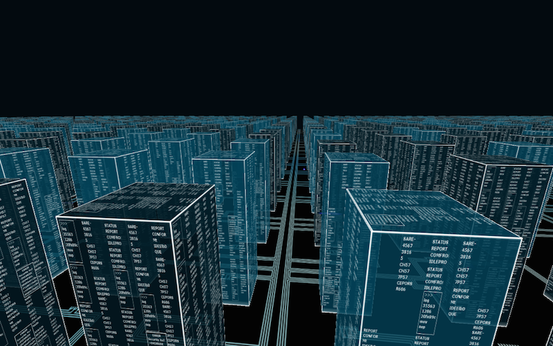
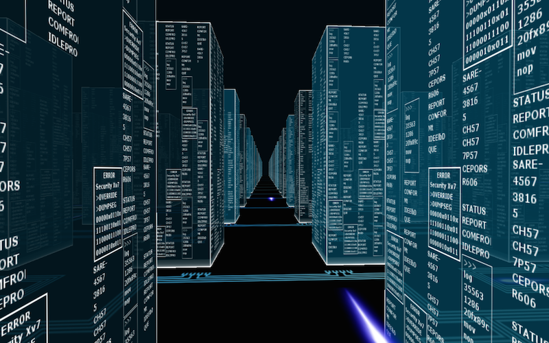

# The Gibson

> "Mess with the best, die like the rest." - Dade Murphey a.k.a. Crash
> Override a.k.a. Zero Cool

It's hard to believe [it's been over 20 years](http://passcode.csmonitor.com/hackers)
since we were all flown through the Gibson for the first time. Worse
than that though is the lack of how this totally righteous and authentic
hacking UI never caught on to the mainstream. This project aims to
revive the dashboard of the most 1337 H4X0Rs and serve as a reminder to
your friends that their garbage files aren't safe, even when your Gibson
is sleeping.

A little googling revealed a previous attempt at a screensaver by
[John Serafino](https://sites.google.com/site/lazerbladegames/the-gibson)
for Windows. Here I pare his implementation down to work on osx (and
eventually other platforms) and open it up to the hacker community to
extend to their heart's desire.

Pull requests welcome!

# Screenshots


*omg, such cool*


*wow, real hackz*


# Installation

```bash
# Install the Irrlicht 3d engine via homebrew and dependencies
brew install irrlicht glfw3 glew

# Build the makefile deps
cd src
make

# Run!
./gibson
```

# Known Issues

1. This isn't an actual screensaver installable on a mac. (YET!)
2. The thing segfaults on exit. (Patience, patience...)


# Credit

All credit goes to the leet [John Serafino](https://sites.google.com/site/lazerbladegames/the-gibson)
for the work on the original Windows version of this screensaver. 


# License

Licensed under the GPL v3 License.
