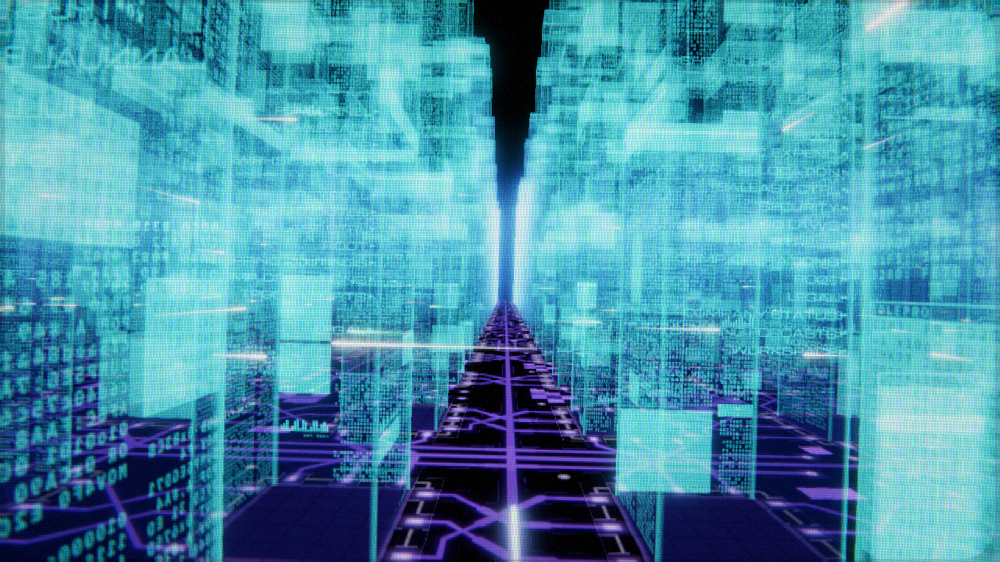
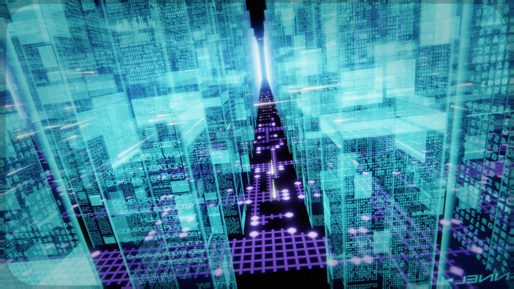

# Hack the Gibson

A screensaver and desktop toy that flies through the Gibson: the fictional
supercomputer from the 1995 film _Hackers_, visualized as a city of
translucent data towers standing in blackness on a circuit-board floor.

This is a Rust + wgpu rewrite of John Serafino's 2015 Irrlicht/OpenGL
original. One renderer core drives every platform — a macOS screen saver, a
Windows `.scr`, a Linux xscreensaver hack, a windowed desktop app, and a
WebGPU/WebGL2 web build — and the visuals are graded against real frames
from the film rather than guessed; see
[docs/film-reference.md](docs/film-reference.md) for the sources and the
production research.



## Live demo

**<https://paulkiernan.github.io/hack-the-gibson/>**

The page uses WebGPU where the browser exposes it and falls back to WebGL2
otherwise — so Chrome 113+, Safari 26+, and Firefox with WebGPU enabled run
the WebGPU path, and any WebGL2-capable browser without WebGPU still gets
the scene through the fallback. The URL accepts query parameters — see the
Web entry under [Settings](#settings).

To host it yourself instead, `hack-the-gibson-web.zip` on the
[Releases page](https://github.com/paulkiernan/hack-the-gibson/releases/latest)
is a static build of the same page. Unzip it and serve it over HTTP — the
wasm module needs server headers, so a `file://` URL will not work:

```bash
unzip hack-the-gibson-web.zip
cd web
python3 -m http.server 8080
```

## Screenshots




## Install

Prebuilt downloads for every host are attached to the
[Releases page](https://github.com/paulkiernan/hack-the-gibson/releases/latest).
A release is published whenever a semver tag is pushed — the version alone,
with no `v` prefix — and the tag must equal the workspace version in
`Cargo.toml` character for character (the release workflow refuses to build
if it does not). A prerelease tag such as `2.1.0-rc.1` publishes as a GitHub
prerelease rather than as the latest stable release. If you want the tip of
`main` instead, every host builds from source — see [Building](#building).

Each release carries the same six assets:

| Asset | What it is |
| --- | --- |
| `Gibson.saver.zip` | macOS screen saver bundle, universal (arm64 + x86_64) |
| `Gibson.scr` | Windows screen saver |
| `hack-the-gibson-macos-universal.tar.gz` | macOS windowed desktop app |
| `hack-the-gibson-linux-x86_64.tar.gz` | Linux desktop app / xscreensaver hack, including `gibson.xml` |
| `hack-the-gibson-web.zip` | the static web build, for self-hosting |
| `SHA256SUMS` | checksums covering every asset above |

Download the asset you want and `SHA256SUMS` into the same directory, then
verify the download before installing:

```bash
# macOS
shasum -a 256 -c SHA256SUMS

# Linux
sha256sum -c SHA256SUMS
```

The names in `SHA256SUMS` are the bare asset names above, so both commands
work from your download directory with no paths to adjust. `SHA256SUMS`
covers every asset in the release, so if you fetched only some of them, add
`--ignore-missing` (`shasum -a 256 -c --ignore-missing SHA256SUMS`) and the
assets you did not download are skipped instead of reported as `FAILED open
or read`.

### macOS screen saver

Requires macOS 14 or later. Either build it yourself (see
[Building](#building)), or download `Gibson.saver.zip` (universal — Apple
silicon and Intel) and `SHA256SUMS` from the
[Releases page](https://github.com/paulkiernan/hack-the-gibson/releases/latest).

```bash
# From your download directory, with the zip and SHA256SUMS both present:
shasum -a 256 -c --ignore-missing SHA256SUMS

# Unzip it and put the bundle where macOS looks for screen savers:
unzip Gibson.saver.zip
cp -R Gibson.saver "$HOME/Library/Screen Savers/"

# Make the running screen-saver process pick up the new bundle:
killall legacyScreenSaver 2>/dev/null || true
```

Then pick **The Gibson** in System Settings > Wallpaper > Screen Saver.
`make install-saver` does those same steps for a build from source.

**Gatekeeper note:** the bundle is ad-hoc signed and not notarized. If macOS
refuses the downloaded copy the first time, right-click `Gibson.saver` and
choose Open, or approve it in System Settings > Privacy & Security, and copy
it into `~/Library/Screen Savers/` yourself. The `SHA256SUMS` file shipped
next to the zip lets you verify the download before you do any of that.

Remove it with `make uninstall-saver`, or by deleting the bundle from
`~/Library/Screen Savers/`.

### Windows `.scr`

Download `Gibson.scr` from the
[Releases page](https://github.com/paulkiernan/hack-the-gibson/releases/latest)
and install it the classic way: right-click the file and choose **Install**,
or copy it to `C:\Windows\System32\Gibson.scr` and pick "The Gibson" in
Settings > Personalization > Lock screen > Screen saver settings. Windows
marks downloaded programs as internet-sourced, so if SmartScreen warns,
choose **More info** > **Run anyway**, or clear the mark first with
`Unblock-File .\Gibson.scr`.

The same binary understands `/s` (full screen), `/p <hwnd>` (preview tile),
and `/c` (opens the settings file). Full steps are in
[platform/windows/README.md](platform/windows/README.md). To build it
yourself instead:

```text
cargo build --release -p gibson-app
copy target\release\gibson-app.exe Gibson.scr
```

**Unverified on real hardware:** the Windows host is compile-verified in CI
only — nobody has run it yet — so the release download is the convenient
path, not a proven one. Treat it accordingly.

### Linux xscreensaver

`gibson-app` doubles as an xscreensaver "external window" hack. The
`hack-the-gibson-linux-x86_64.tar.gz` asset on the
[Releases page](https://github.com/paulkiernan/hack-the-gibson/releases/latest)
contains the binary and the `gibson.xml` descriptor, and unpacks into a
`hack-the-gibson-linux-x86_64/` directory:

```bash
# From your download directory, with the tarball and SHA256SUMS present:
sha256sum -c --ignore-missing SHA256SUMS

tar -xzf hack-the-gibson-linux-x86_64.tar.gz
cd hack-the-gibson-linux-x86_64

# Put the binary on PATH as `gibson`, and the descriptor where
# xscreensaver looks for it:
install -Dm755 gibson-app "$HOME/.local/bin/gibson"
sudo install -Dm644 gibson.xml /usr/share/xscreensaver/config/gibson.xml
```

Then add this line to `~/.xscreensaver` (create it with `xscreensaver-demo`
first if needed):

```text
programs: gibson -root
```

That line resolves `gibson` on `PATH`; give the absolute path instead if
`~/.local/bin` is not on yours.

`cargo build --release -p gibson-app` produces the same binary from source,
and [`platform/linux/gibson.xml`](platform/linux/gibson.xml) is the
descriptor the tarball ships. Full steps and the settings-dialog note are in
[platform/linux/README.md](platform/linux/README.md).

**Unverified on real hardware:** the xscreensaver host is compile-verified in
CI only — nobody has run it yet. It is also X11 only: on a Wayland session
use `swayidle` plus `gibson-app --fullscreen` instead (see the same file for
the exact command).

### Desktop app (any platform)

Grab `hack-the-gibson-macos-universal.tar.gz` (universal) or
`hack-the-gibson-linux-x86_64.tar.gz` (glibc x86_64) from the
[Releases page](https://github.com/paulkiernan/hack-the-gibson/releases/latest);
each unpacks into a directory holding `gibson-app`:

```bash
tar -xzf hack-the-gibson-macos-universal.tar.gz
./hack-the-gibson-macos-universal/gibson-app

# If macOS refuses to run the downloaded binary (quarantine), either
# right-click it and choose Open, or clear the flag:
xattr -d com.apple.quarantine hack-the-gibson-macos-universal/gibson-app
```

Or run it from source:

```bash
cargo run --release -p gibson-app
```

A windowed flythrough opens; press Esc or Q to quit. Useful flags (see
`--help` for the full list):

```text
--fullscreen                          borderless fullscreen
--snapshot out.png --size 1920x1080   render one offscreen still and exit
        --time 12                     (seconds of simulated flight for the still;
                                       deterministic for a fixed --seed)
--speed 0.8                           fly speed
--bank 0.9                            banking strength
--palette normal|siege|cycle          color treatment
--grid 40                             city size (grid x grid towers)
--pulses 200                          lane pulse streaks
--seed 12345                          reproducible city and flight (0 = time-derived)
--render-scale 0.5                    internal resolution multiplier
--no-bloom --no-motion-blur --no-crt  disable individual effects
--config /path/to/gibson.toml         alternate settings file
```

**Platform status, stated plainly:** the macOS saver, the desktop app, and
the web build are the runtime-tested paths. The Windows `.scr` and Linux
xscreensaver hosts are **compile-verified in CI only — nobody has run them
yet**; they are documented as untested in their platform READMEs and should
be treated accordingly.

## Settings

One settings struct drives every host. All values are clamped to legal
ranges on load, so a bad config file, CLI value, or query parameter can
never put the renderer out of bounds.

| Setting | Default | Range | Effect |
| --- | --- | --- | --- |
| `fly_speed` | 0.55 | 0.05–3 | Speed along the flight path (segments per second) |
| `bank_strength` | 0.45 | −3–3 | How hard the camera banks into turns |
| `bank_max_degrees` | 32 | 0–60 | Maximum bank angle, degrees |
| `bank_smoothing` | 0.55 | 0.05–2 | Bank low-pass time constant, seconds |
| `palette` | `normal` | `normal`, `siege`, `cycle` | Color treatment (blues / attack oranges / timed cycling) |
| `palette_cycle_seconds` | 240 | 10–3600 | Seconds between switches in `cycle` mode |
| `bloom` | 0.35 | 0–2 | Bloom intensity; 0 disables bloom |
| `motion_blur` | 0.5 | 0–1 | Motion-blur strength; 0 disables |
| `grain` | 0.03 | 0–0.2 | Film-grain amount; 0 disables |
| `crt` | 0.35 | 0–1 | CRT-overlay strength (scanlines, aperture grille, curvature, phosphor bloom, edge vignette); 0 disables |
| `render_scale` | 1.0 | 0.25–1 | Internal resolution multiplier; lower is cheaper on slow GPUs |
| `grid` | 60 | 8–120 | City size: `grid x grid` towers |
| `pulses` | 700 | 0–2000 | Number of pulse streaks down the lanes |
| `seed` | 0 | any 64-bit integer | City, atlas, and floor seed; 0 derives one from the clock |
| `preview` | false | true / false | Screensaver-preview mode; hosts set this themselves |

Where each host stores or accepts them:

- **macOS Options sheet** (System Settings > Wallpaper > Screen Saver >
  Options…, or right-click the preview): sliders **Fly speed** (0.2–1.2),
  **Banking** (0–1), and **CRT overlay** (0–1); a **Palette** popup with
  Normal / Siege / Cycle; and **Bloom glow**, **Motion blur**, and
  **Film grain** checkboxes (unchecked disables the effect). Changes apply
  on the next activation.
- **`gibson.toml`**: created automatically — with every key, its default,
  and a comment — the first time a desktop host or `--snapshot` run starts,
  at `<config-dir>/hack-the-gibson/gibson.toml`, where `<config-dir>` is
  `~/Library/Application Support` on macOS, `~/.config` on Linux, and
  `%APPDATA%` on Windows. The Windows `/c` mode also ensures the file
  exists and opens it in your editor. Unknown keys are ignored; missing
  keys fall back to defaults.
- **Desktop CLI**: `--speed`, `--bank`, `--palette`, `--grid`, `--pulses`,
  `--grain`, `--crt`, `--seed`, `--render-scale`, and the
  `--no-bloom` / `--no-motion-blur` / `--no-crt` switches, applied on top of
  the config file.
- **Web**: the same names as query parameters on the demo URL, except
  `fly_speed` is `speed`, `bank_strength` is `bank`, and `render_scale` is
  `scale`:

  ```text
  https://paulkiernan.github.io/hack-the-gibson/?palette=cycle&grid=40&pulses=200
  ```

  Supported: `speed`, `bank`, `palette`, `grid`, `pulses`, `seed`, `scale`,
  `bloom`, `motionblur`, `grain`, `crt`.

Precedence everywhere is: built-in defaults < `gibson.toml` < command-line
or query overrides.

## Building

Prerequisites:

- Rust stable (the workspace pins `stable` in `rust-toolchain.toml`)
- For the web build: `rustup target add wasm32-unknown-unknown` and
  `cargo install wasm-pack --locked`
- For a universal macOS saver (arm64 + x86_64 slices):
  `rustup target add aarch64-apple-darwin x86_64-apple-darwin`
  (the saver Makefile defaults to both; build just your arch with
  `make -C platform/macos ARCHS=arm64`)

Root Makefile targets (each delegates to cargo or a platform Makefile):

| Target | What it does |
| --- | --- |
| `make app` | Run the windowed desktop app |
| `make snapshot` | Render `docs/screenshots/lane.png` (1920x1080, t=12 s) |
| `make web` | `wasm-pack build` of `crates/gibson-web` into `web/pkg` |
| `make saver` | Build `platform/macos/build/Gibson.saver` |
| `make install-saver` / `make uninstall-saver` | Install / remove the saver |
| `make test` | `cargo test --workspace --exclude gibson-web` |
| `make clean` | `cargo clean` |

Notable: the macOS saver builds with **Command Line Tools only — no Xcode
required**. It is a Makefile that compiles the Rust core to a staticlib,
links it into a Swift dylib with `swiftc`, `lipo`s the architectures
together, wraps the result in a `.saver` bundle, and ad-hoc codesigns it
(recipe proven by the PerfectoWeb/Gibson saver). CI tests and builds every
target — macOS (tests + saver), Windows (tests + `.scr`), Linux (tests +
xscreensaver host), and wasm (web bundle) — and pushing a semver tag (no `v`
prefix) publishes all of those builds as a
[release](https://github.com/paulkiernan/hack-the-gibson/releases/latest)
with checksums.

## How it works

The workspace is a set of small crates with one contract crate,
`gibson-types`, that everything compiles against:

- **Deterministic procedural content.** A 64-bit `seed` reproduces the same
  city, text, and floor exactly. The text atlas (`gibson-atlas`) generates
  64 layers of 256x768 RGBA: 32 tower-face panels, each with two text
  variants that share byte-identical block geometry. Panels 0–28 are dense
  mosaics of mono-text blocks — hex dumps, numeric columns, keyword rows,
  bar-chart glyphs, framed and inverse-video blocks — in IBM Plex Mono;
  panels 28–32 are hero directory lists (Michroma, the Eurostile-Extended-
  style face) whose entries double as individually highlightable blocks. The
  floor (`gibson-floor`) generates a toroidal 96x96-cell PCB tile: random-
  walk Manhattan traces with pads, vias, and chips that wrap seamlessly.
- **The city.** A `grid x grid` array of towers standing in the lanes of the
  2015 world grid. Towers are instanced translucent glass boxes 12 units
  wide and 44–110 tall, drawn double-sided so back-face text bleeds through
  the body. In the shader, each text block clears and redraws top-down on
  its own cycle, alternating between the two text variants; occasionally a
  block on a nearby tower lights up in the palette's highlight color, and
  pulse streaks run down the lanes between towers.
- **The camera.** The closed-loop flight path was rescued from the 2015 C++
  waypoints (z-negated for a right-handed Y-up world), and the banking
  algorithm — a low-passed yaw rate driving a smoothed roll — was ported
  from the SceneKit fork that this project grew out of.
- **The frame graph.** The scene renders at `render_scale` into an HDR
  (16-bit float) target: floor, towers, pulses, then a bloom prefilter with
  a downsample/upsample chain, motion blur by depth reprojection against the
  previous frame, and a final composite applying ACES tonemapping, chromatic
  aberration, film grain, and vignette — plus, when `crt > 0`, a CRT
  treatment (scanlines, aperture grille, screen curvature, phosphor smear)
  as the last step. Distant towers fade through a blue haze to black, and
  the whole look is graded against the film reference in
  [docs/film-reference.md](docs/film-reference.md).

## Credits

- **John Serafino** — the 2015 Irrlicht original this is a rewrite of.
- **dherberger** — the 2026 macOS SceneKit/Metal `.saver` fork that proved
  the screensaver path and whose banking code and grid conventions carried
  over; the fork was merged back upstream to become this project.
- The film crew whose work is being reproduced: **Peter Chiang** (VFX
  supervisor), **Tim Field** (VFX producer), and **Neville Brody** (type
  design). The film's towers were built as clear perspex prisms with printed
  text cels, shot on motion control at Pinewood, and designed after Muriel
  Cooper's MIT "Information Landscapes".

## License

GPL-3.0-or-later (see [GPL.txt](GPL.txt)). The bundled fonts — Michroma
Regular and IBM Plex Mono Medium — are SIL Open Font License; their license
text ships in [assets/fonts/OFL-Michroma.txt](assets/fonts/OFL-Michroma.txt)
and [assets/fonts/OFL-IBMPlexMono.txt](assets/fonts/OFL-IBMPlexMono.txt).
