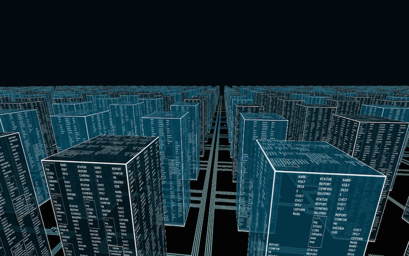
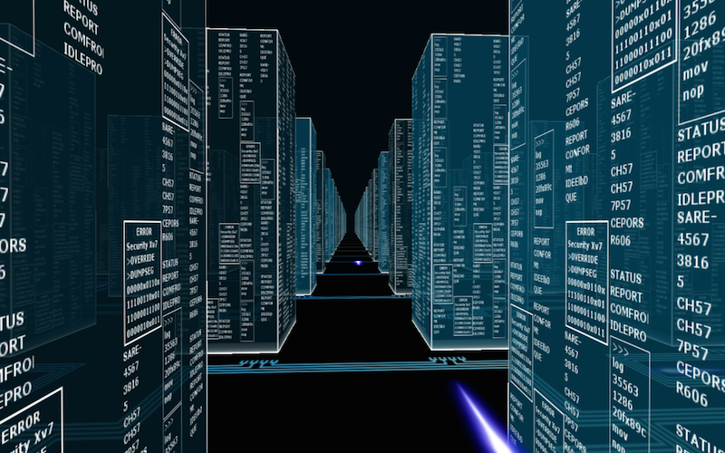

# The Gibson

# Credit Where Credit Is Due
This is a fork of a repo archived by someone that cared enough to keep it alive - I have merely AI slop coded my way to making it work for my purposes; please credit the original maintainers of this work, paulkiernan and John Serafino. They are truly elite.


> "Mess with the best, die like the rest." - Dade Murphey a.k.a. Crash
> Override a.k.a. Zero Cool

It's hard to believe [it's been over 20 years](http://passcode.csmonitor.com/hackers)
since we were all flown through the Gibson for the first time. Worse
than that though is the lack of how this totally righteous and authentic
hacking UI never caught on to the mainstream. This project aims to
revive the dashboard of the most 1337 H4X0Rs and serve as a reminder to
your friends that their garbage files aren't safe, even when your Gibson
is sleeping.

A little googling revealed a previous attempt at a screensaver by
[John Serafino](https://sites.google.com/site/lazerbladegames/the-gibson)
for Windows. Here I pare his implementation down to work on osx (and
eventually other platforms) and open it up to the hacker community to
extend to their heart's desire.

Pull requests welcome!

# Screenshots


*omg, such cool*


*wow, real hackz*


# Installation

Requires macOS with [Homebrew](https://brew.sh) and a C++17 compiler (Xcode Command Line Tools).

```bash
# Install the Irrlicht 3d engine via Homebrew
brew install irrlicht

# Build from the project root
make

# Run (windowed). Press Escape or Q to quit.
make run
# or: ./src/gibson

# Full-display flythrough (borderless window; Escape or Q to quit)
./src/gibson --fullscreen
```

The Makefile locates Irrlicht through Homebrew (`/opt/homebrew` on Apple Silicon, `/usr/local` on Intel) instead of a hardcoded Cellar version.

## Screensaver

Build a macOS `.saver` bundle that System Settings can load. The saver is SceneKit/Metal and does not need Homebrew at runtime.

```bash
make saver
make install-saver
```

That copies `dist/Gibson.saver` to `~/Library/Screen Savers/Gibson.saver`. Then fully quit System Settings, reopen it, and choose **The Gibson**.

The System Settings preview uses a smaller tower grid. The lock-screen saver uses the full flythrough.

To iterate on the SceneKit scene without opening System Settings:

```bash
make scn
# or: ./src/scn_preview --preview
```

Press Escape or Q to quit. The original Irrlicht windowed app is unchanged (`make` / `make run`).

Camera speed and banking live in a text config:

```
~/Library/Application Support/TheGibson/config.txt
```

`fly_speed` default is `0.55` (original demo was `0.9`). `bank_strength` defaults to `0.45`; `0` keeps the camera level. `bank_smoothing` (seconds) damps the roll. Edit and trigger the saver again. `make install-saver` does not overwrite existing values.

Remove the screensaver with `make uninstall-saver`.

# Known Issues

1. The windowed app still uses Irrlicht's deprecated OpenGL path. The screensaver is SceneKit/Metal. If the System Settings preview is stale, fully quit System Settings and reopen it so it reloads the `.saver` bundle.


# Credit

All credit goes to the leet [John Serafino](https://sites.google.com/site/lazerbladegames/the-gibson)
for the work on the original Windows version of this screensaver. 


# License

Licensed under the GPL v3 License.
